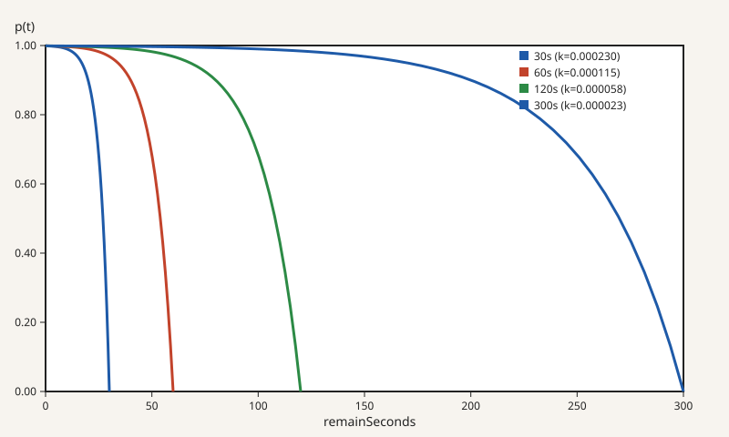

<p align="center">
  
</p>

# crema ☕️

A Go cache library with probabilistic revalidation and optional singleflight
loading. It smooths refreshes near TTL expiry while deduplicating concurrent
loads.

## Features

- Smooth probabilistic revalidation near expiry
- Built-in singleflight loader (can be disabled)
- Zero external dependencies in the core module
- Pluggable storage (`CacheProvider`) and storage codecs (`CacheStorageCodec`)

Core functionality is covered by a high level of automated tests.

## Revalidation Algorithm

Within the revalidation window, the cache reloads with probability

```math
p(t)=1-e^{-kt}
```

where `t` is the remaining time. The steepness `k` is set so that
$`p(t)=0.999`$ at the configured window boundary, smoothing spikes near expiry.



This design is inspired by the following references:

- [Cache Stampede: Avoiding Hot Spots in Distributed Caching Systems](https://cseweb.ucsd.edu/~avattani/papers/cache_stampede.pdf)
- [Sometimes I Cache | The Cloudflare Blog](https://blog.cloudflare.com/sometimes-i-cache/)

## Installation

```sh
go get github.com/abema/crema
```

Providers and codecs under `ext/` are separate Go modules. Add only the modules
your application uses. For example:

```sh
go get github.com/abema/crema/ext/golang-lru
```

Go 1.25 or newer is required.

## Quick Start

```go
package main

import (
	"context"
	"fmt"
	"time"

	"github.com/abema/crema"
	golanglru "github.com/abema/crema/ext/golang-lru"
)

func main() {
	provider := golanglru.NewCacheProvider[crema.CacheObject[int]](128, time.Minute)
	cache := crema.NewCache(provider, crema.NoopCacheStorageCodec[int]{})

	value, err := cache.GetOrLoad(
		context.Background(),
		"answer",
		time.Minute,
		func(context.Context) (int, error) {
			// Database or computation logic here.
			return 42, nil
		},
	)
	if err != nil {
		panic(err)
	}

	fmt.Println(value)
}
```

## Usage Notes

- **CacheProvider**: Responsible for persistence with TTL handling. Works with
  Redis/Memcached, files, or databases.
- **CacheStorageCodec**: Encodes/decodes cached objects. Swap in JSON, protobuf,
  or your own codec.
- **CacheObject**: A thin wrapper holding `Value` and absolute expiry
  (`ExpireAtMillis`).

## Options

- `WithRevalidationWindow(duration)`: Set the revalidation window
- `WithDirectLoader()`: Disable singleflight and call loaders directly
- `WithMaxLoadTimeout(duration)`: Set max duration for loader execution (applies to both loader kinds; a non-positive duration disables it)
- `WithLogger(logger)`: Override warning logger for get/set failures
- `WithMetricsProvider(metrics)`: Record cache and loader events

## Implementations

### CacheProvider

| Name | Package | Notes | Example |
| --- | --- | --- | --- |
| RistrettoCacheProvider | `github.com/abema/crema/ext/ristretto` | dgraph-io/ristretto backend with TTL support. | [✅](example/ristretto_test.go) |
| RedisCacheProvider | `github.com/abema/crema/ext/rueidis` | Redis backend using rueidis. | [✅](example/rueidis_test.go) |
| ValkeyCacheProvider | `github.com/abema/crema/ext/valkey-go` | Valkey (Redis protocol) backend. | [✅](example/valkey_go_test.go) |
| MemcachedCacheProvider | `github.com/abema/crema/ext/gomemcache` | Memcached backend with TTL handling. | - |
| CacheProvider | `github.com/abema/crema/ext/golang-lru` | hashicorp/golang-lru backend with a fixed default TTL. | [Quick Start](#quick-start) |
| Provider | `github.com/abema/crema/ext/madvfree` | Best-effort anonymous-mmap byte cache for 64-bit Linux and macOS. | [✅](example/madvfree_test.go) |

### CacheStorageCodec

| Name | Package | Notes | Example |
| --- | --- | --- | --- |
| NoopCacheStorageCodec | `github.com/abema/crema` | Pass-through codec for in-memory cache objects. | [Quick Start](#quick-start) |
| JSONByteStringCodec | `github.com/abema/crema` | Standard library JSON encoding to `[]byte`. | [✅](example/madvfree_test.go) |
| JSONByteStringCodec | `github.com/abema/crema/ext/go-json` | goccy/go-json encoding to `[]byte`. | - |
| ProtobufCodec | `github.com/abema/crema/ext/protobuf` | Protobuf encoding to `[]byte`. | [✅](example/protobuf_test.go) |
| BinaryCompressionCodec | `github.com/abema/crema` | Wraps another codec and zlib-compresses encoded bytes above a threshold. | [✅](example/binary_compression_test.go) |

### MetricsProvider

| Name | Package | Notes | Example |
| --- | --- | --- | --- |
| BaseMetricsProvider | `github.com/abema/crema` | Embeddable no-op base for custom metrics providers. | - |
| NoopMetricsProvider | `github.com/abema/crema` | Default metrics provider; records nothing. | - |

## Concurrency

`Cache` is goroutine-safe as long as its `CacheProvider` and
`CacheStorageCodec` implementations are goroutine-safe.

## Development

```sh
go generate
go test ./... $(find ./ext/ -type d -mindepth 1 -maxdepth 1 | sed 's|$|/...|') ./ext/madvfree/bench/...
```

Examples that use Redis or Valkey require a server on `127.0.0.1:6379`; CI
runs them separately with the required service.

## Tools

- `cmd/plot-revalidation`: SVG plot generator for revalidation curves

## Why "crema"?

Crema is the golden foam that forms on top of a freshly pulled espresso coffee
shot. Like crema that gradually dissipates over time, this cache library
probabilistically refreshes entries, ensuring your data stays fresh without the
overhead of deterministic expiration checks.
